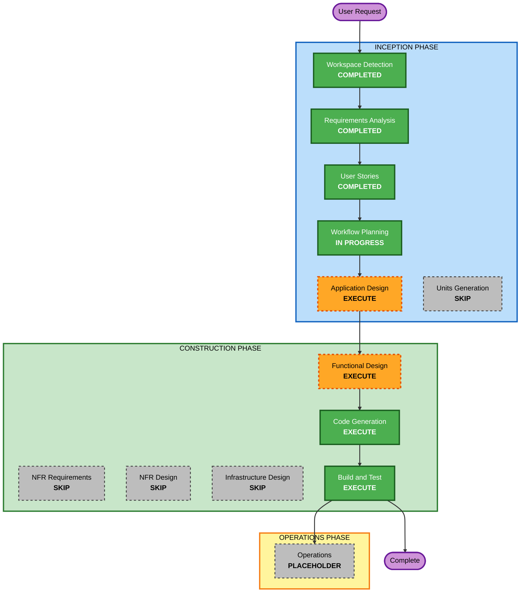

# 실행 계획 (Execution Plan)

## 상세 분석 요약

### 프로젝트 특성
- **프로젝트 유형**: Greenfield (신규 프로젝트)
- **현재 상태**: 메뉴 조회 중심의 초기 구현 완료 (백엔드 API + 고객용 프론트엔드 동작 중)
- **목표**: 요구사항 정의서의 MVP 전체 기능 완성

### 변경 영향 평가 (Change Impact Assessment)
- **사용자 대면 변경**: Yes — 고객용/관리자용 인터페이스 모두 신규 개발
- **구조적 변경**: Yes — 프론트엔드/백엔드 분리 구조, SSE 실시간 통신
- **데이터 모델 변경**: Yes — Store, Table, Session, Category, MenuItem, Order, OrderItem, OrderHistory 8개 엔티티
- **API 변경**: Yes — 메뉴/주문/테이블/인증/SSE 엔드포인트
- **NFR 영향**: Yes — 실시간성(2초 이내), 다중 매장 규모, 터치 사용성

### 위험 평가 (Risk Assessment)
- **위험 수준**: Medium
  - 단일 코드베이스, 로컬 개발 환경, 롤백 용이
  - 실시간(SSE) 통신과 세션 라이프사이클 로직에 일부 복잡성 존재
- **롤백 복잡도**: Easy (로컬, 버전 관리 기반)
- **테스트 복잡도**: Moderate (실시간/세션 상호작용 검증 필요)

---

## 워크플로우 시각화



### 텍스트 대안 (Text Alternative)
```
INCEPTION PHASE
- Workspace Detection: COMPLETED
- Requirements Analysis: COMPLETED
- User Stories: COMPLETED
- Workflow Planning: IN PROGRESS
- Application Design: EXECUTE
- Units Generation: SKIP

CONSTRUCTION PHASE
- Functional Design: EXECUTE
- NFR Requirements: SKIP
- NFR Design: SKIP
- Infrastructure Design: SKIP
- Code Generation: EXECUTE
- Build and Test: EXECUTE

OPERATIONS PHASE
- Operations: PLACEHOLDER
```

---

## 실행할 단계 (Phases to Execute)

### 🔵 INCEPTION PHASE
- [x] Workspace Detection (COMPLETED)
- [x] Reverse Engineering (SKIPPED — Greenfield)
- [x] Requirements Analysis (COMPLETED)
- [x] User Stories (COMPLETED)
- [x] Workflow Planning (IN PROGRESS)
- [ ] Application Design — **EXECUTE**
  - **Rationale**: 고객/관리자 컴포넌트와 서비스 계층, 데이터 모델 관계 정의가 필요. 특히 관리자 대시보드 등 미구현 컴포넌트의 책임과 의존성을 명확히 해야 함.
- [ ] Units Generation — **SKIP**
  - **Rationale**: 단일 풀스택 애플리케이션(프론트엔드+백엔드)으로 규모가 명확하며, 다중 서비스/모듈로 분해할 필요 없음. 기능 단위로 순차 구현 가능.

### 🟢 CONSTRUCTION PHASE
- [ ] Functional Design — **EXECUTE**
  - **Rationale**: 테이블 세션 라이프사이클, 주문 상태 전이, 과거 이력 이동 등 복잡한 비즈니스 로직의 상세 설계가 필요.
- [ ] NFR Requirements — **SKIP**
  - **Rationale**: 기술 스택과 NFR(실시간성, 사용성)이 요구사항 분석에서 이미 결정됨. 보안/PBT 확장도 opt-out 상태. 추가 NFR 평가 불필요.
- [ ] NFR Design — **SKIP**
  - **Rationale**: NFR Requirements가 SKIP이므로 연동 SKIP. SSE/세션 패턴은 Functional Design에서 다룸.
- [ ] Infrastructure Design — **SKIP**
  - **Rationale**: 로컬 개발 환경 우선(배포 후순위). 클라우드 인프라 매핑 불필요.
- [ ] Code Generation — **EXECUTE (ALWAYS)**
  - **Rationale**: 미구현 MVP 기능(관리자 대시보드, 인증, 메뉴 관리, 테이블 관리 UI) 구현 필요.
- [ ] Build and Test — **EXECUTE (ALWAYS)**
  - **Rationale**: 빌드, 통합 테스트, 검증 필요.

### 🟡 OPERATIONS PHASE
- [ ] Operations — **PLACEHOLDER**
  - **Rationale**: 향후 배포/모니터링 워크플로우용. 현재 범위 외.

---

## 구현 우선순위 (Implementation Priority)

기능 단위로 다음 순서로 구현을 권장합니다:

1. **[완료] 메뉴 조회 + 장바구니 + 주문 생성 + 주문 내역** (고객 흐름)
2. **관리자 인증** (US-A1) — JWT 16시간 세션
3. **관리자 실시간 주문 모니터링** (US-A2) — SSE 대시보드 UI
4. **주문 상태 변경 / 주문 삭제** (US-A3, US-A4)
5. **테이블 관리** (US-A5, US-A6) — 이용 완료, 태블릿 초기 설정
6. **과거 주문 내역 조회** (US-A7)
7. **메뉴 관리 CRUD** (US-A8) — 이미지 로컬 업로드 포함

---

## 성공 기준 (Success Criteria)
- **Primary Goal**: 요구사항 정의서의 MVP 전체 기능을 동작하는 형태로 구현
- **Key Deliverables**: 고객용 SPA, 관리자 대시보드, 백엔드 API, SQLite 데이터 계층
- **Quality Gates**:
  - 백엔드/프론트엔드 빌드 성공
  - 핵심 사용자 여정(주문 생성 → 관리자 실시간 확인 → 상태 변경 → 이용 완료) 정상 동작
  - 각 유저 스토리의 수용 기준 충족

## 예상 일정 (Estimated Timeline)
- **실행 단계 수**: 4개 (Application Design, Functional Design, Code Generation, Build and Test)
- **예상 기간**: 반복적 구현으로 진행 (사용자 요청 단위로 기능별 완성)
